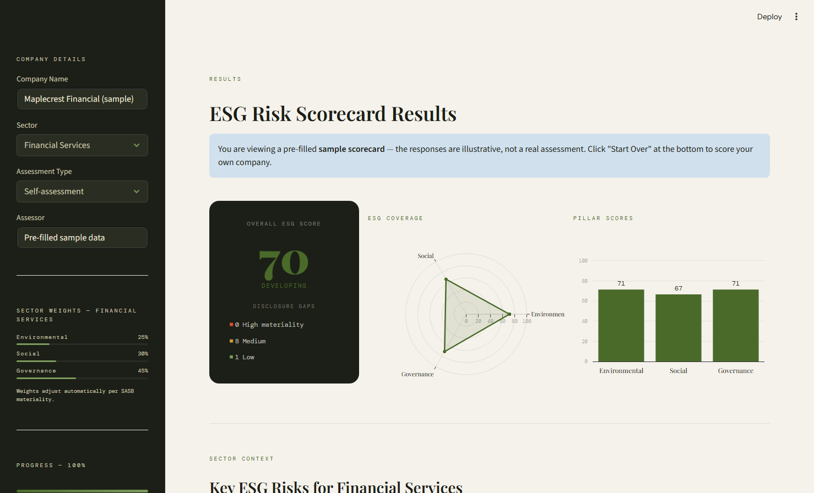

# ESG Corporate Risk Scorecard

A sector-adjusted ESG (Environmental, Social, Governance) risk scoring tool that uses SASB materiality weights to produce ESG ratings appropriate to the industry being scored. A financial services company is weighted toward governance, an energy company toward environmental, a consumer goods company toward social — reflecting what SASB identifies as financially material in each sector. TCFD-aligned for climate disclosure structure, with GRI Standards as the underlying disclosure framework.

**Live tool:** https://esg-corporate-risk-scorecard-2oky9ixncf9k384hvmantw.streamlit.app  
*(Hosted on Streamlit Community Cloud — may take 30 seconds to load on first visit. Use the "View a sample scorecard" button on the landing screen to jump straight to a scored example.)*

---

## What this tool does

ESG scoring is widely critiqued for treating all sectors the same — a one-size-fits-all approach that produces ratings disconnected from sector-specific reality. SASB (the Sustainability Accounting Standards Board) addressed this by publishing materiality maps that identify which ESG factors are financially material for each industry.

This tool applies that thinking to a corporate ESG scorecard:

- Select an industry from nine sector options (Financial Services, Energy & Utilities, Technology, Healthcare, Manufacturing, Consumer Goods/Retail, Real Estate, Telecommunications, Other)
- Work through 20 ESG disclosure questions across three pillars
- Receive a score weighted by SASB materiality for that sector, with disclosure-gap findings and recommended actions

A financial services company's score will be heavily influenced by governance factors (45% weight). An energy company's score will be dominated by environmental factors (50% weight). A healthcare company will weight social factors most heavily (45%). The framing follows what is *financially material* in each sector rather than treating ESG as a single uniform construct.

The tool also incorporates TCFD (Task Force on Climate-related Financial Disclosures) alignment for climate risk disclosure structure, and references GRI 200/300/400 series, UN SDGs, ILO Core Conventions, and OECD Corporate Governance Principles across the question set.

---

## What I designed

The scoring architecture is mine. I designed:

- **The sector materiality weights** across nine industries, drawing on SASB's published materiality framework
- **The 20 ESG questions** across Environmental, Social, and Governance pillars, with materiality ratings (high/medium/low) for each
- **The scoring logic** — how indicator-level responses aggregate into pillar scores, and how sector weights are applied to produce the overall score
- **The plain-language "why this matters" rationale** for each question, grounding it in real regulatory context (CSRD, UN Guiding Principles, EU Pay Transparency Directive, etc.)
- **The output structure** — pillar radar chart, sector-specific material-risk callouts, disclosure-gap findings, and the recommendation logic
- **The TCFD alignment overlay** — which TCFD pillars (Governance, Strategy, Risk Management, Metrics) inform which parts of the scorecard

## What I did not build from scratch

I designed the sector-adjustment methodology, the question architecture, and the standards integration. The Python/Streamlit implementation was AI-assisted: the code captures inputs, applies the weighting logic I designed, and renders the score.

---

## Why this matters

Most accessible ESG scoring tools either ignore sector materiality entirely or apply it in ways that obscure the underlying logic. This tool surfaces the materiality reasoning explicitly — *here is why your sector weights environmental more heavily, here is the SASB rationale, here is how the score moves when you adjust an input.* Users can disagree with the weights, but they can see them.

The plain-language explanation under every question is the deliberate part. Most ESG tooling assumes the user already knows what TCFD is, what Scope 3 means, what the UN Guiding Principles cover. This one explains the regulatory and investor context for each question, which makes it useful as a learning tool as well as a scoring tool.

---

## Standards referenced

- **SASB Materiality Map** (Sustainability Accounting Standards Board)
- **TCFD** — Task Force on Climate-related Financial Disclosures
- **GRI Standards** — GRI 200 (Governance), GRI 300 (Environmental), GRI 400 (Social)
- **UN Sustainable Development Goals** — SDG 8, 10, 13
- **UN Guiding Principles on Business and Human Rights**
- **OECD Corporate Governance Principles**
- **ILO Core Conventions**

---

## Disclaimer

This is an educational reference tool built by a student, based on publicly available frameworks and my own research and interpretation. It is not a formal ESG rating, audit opinion, investment recommendation, legal or financial advice, or a regulatory compliance determination, and it is not affiliated with or endorsed by any standards body or regulator. Scores are based on self-reported inputs only. For real investment, procurement, or governance decisions, consult a qualified professional and verify against primary sources (CDP disclosures, company sustainability reports, MSCI ESG, Sustainalytics).

---

## Contact

Designed and architected by Khushi Rana — Psychology × AI Governance @ University of Waterloo.

- ks2rana@uwaterloo.ca
- linkedin.com/in/khushi-rana
- khushi-rana-website.vercel.app
